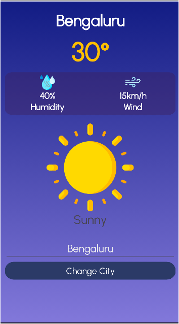

# Weather Forecast App Documentation

## Overview
The Weather Forecast App is a native Android application that fetches real-time weather data from the OpenWeatherMap API and displays current conditions and forecasts in a user-friendly format.

## Features
- Fetches current weather conditions.
- Provides temperature, humidity, wind speed, and weather conditions.
- User-friendly and responsive UI.

## Technologies Used
- Android Studio
- Java (Backend Logic)
- XML (UI Design)
- API: OpenWeatherMap API

## Prerequisites
1. Android Studio installed
2. API Key from OpenWeatherMap

## OpenWeatherMap API Key Setup
1. Visit OpenWeatherMap.
2. Register and obtain an API Key.
3. Store the API Key securely in `strings.xml`:
   ```xml
   <string name="api_key">your_api_key</string>
   ```

## Project Structure
```
WeatherApp/
|-- app/
|   |-- src/
|       |-- main/
|           |-- java/
|           |-- res/
|           |-- AndroidManifest.xml
|-- build.gradle
|-- settings.gradle
```
## API Endpoint
Current Weather Data:
```
https://api.openweathermap.org/data/2.5/weather?q={city}&appid={API_KEY}&units=metric
```
## Installation Steps
Clone the repository:
```bash
git clone https://github.com/your-repo/weather-forecast-app.git
```

1. Open Android Studio and load the project.
2. Add the API Key in res/values/strings.xml.
3. Sync the project with Gradle files.
4. Run the application on an emulator or a physical device.
## XML Layout Code
```xml
<RelativeLayout xmlns:android="http://schemas.android.com/apk/res/android"
    xmlns:tools="http://schemas.android.com/tools"
    android:id="@+id/main"
    android:layout_width="match_parent"
    android:layout_height="match_parent"
    android:background="@drawable/background"
    android:padding="10dp"
    tools:context=".MainActivity">

    <TextView
        android:id="@+id/cityTv"
        android:layout_width="wrap_content"
        android:layout_height="wrap_content"
        android:layout_centerHorizontal="true"
        android:layout_marginTop="10dp"
        android:fontFamily="@font/urbanist"
        android:text="City"
        android:textColor="@color/white"
        android:textSize="36sp"
        android:textStyle="bold" />
        .
        .
        .
        
    <Button
        android:id="@+id/fetchWeatherBt"
        android:layout_width="match_parent"
        android:layout_height="wrap_content"
        android:layout_below="@id/cityNameEt"
        android:backgroundTint="#2b3a67"
        android:fontFamily="@font/urbanist"
        android:text="Change City"
        android:textColor="#fff"
        android:textSize="20sp"/>
</RelativeLayout>
```
## Java Code for Fetching Data
```java
public class MainActivity extends AppCompatActivity {
   private void fetchWeatherData(String cityName) {
         String url = "https://api.openweathermap.org/data/2.5/weather?q=" + cityName + "&appid=" + API_KEY + "&units=metric";
      }

    private void updateUI(String result) {
        try {
            JSONObject jsonObject = new JSONObject(result);
            JSONObject main = jsonObject.getJSONObject("main");
            double temperature = main.getDouble("temp");
            cityTv.setText(jsonObject.getString("name"));
            temperatureTv.setText(String.format("%.0f°", temperature));
        } catch (JSONException e) {
            e.printStackTrace();
        }
    }
}
```
## Screenshots

## Future Enhancements
- Add geolocation support.
- Implement a dark mode.
- Add multiple language support.
- The Weather App provides accurate weather data with a clean UI. By integrating the OpenWeatherMap API, users can stay updated with real-time weather conditions.

## Acknowledgments
- [OpenWeatherMap](https://openweathermap.org/) for providing the weather data API.
- Open-source libraries such as OkHttp for handling HTTP requests.

## Contact
For any inquiries or contributions, feel free to reach out via [Email](mailto:kedlayashreeram@gmail.com).

## Contributing
Contributions are welcome! Please follow these steps to contribute:
1. Fork the repository.
2. Create a new branch (`git checkout -b feature-YourFeature`).
3. Make your changes and commit them (`git commit -m 'Add your feature'`).
4. Push to the branch (`git push origin feature-YourFeature`).
5. Open a pull request.
